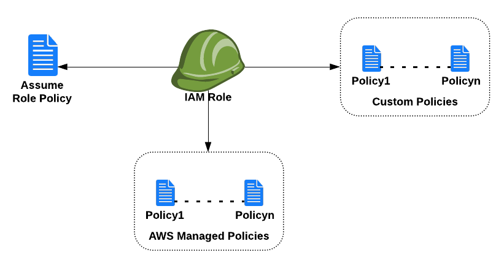

# What is this ?
This module creates an IAM Role with an assume role along with custom or aws managed policies.


Diagram
---



Documentation
---
1. [Input and Outputs](doc.md)
2. [AWS IAM Doc](https://aws.amazon.com/iam/)
3. [Terraform reference](https://www.terraform.io/docs/providers/aws/r/iam_role.html)


Usage
---
#### Simple invocation
```bash
module "test_iam_role" {
  source                = "modules/iam-t12"
  role_name             = "MyTestRole"
  description           = "Testing IAM Role"
  assume_role_policy    = <<EOF
                          {
                            "Version": "2012-10-17",
                            "Statement": [
                              {
                                "Action": "sts:AssumeRole",
                                "Principal": {
                                  "Service": "ec2.amazonaws.com"
                                },
                                "Effect": "Allow",
                                "Sid": ""
                              }
                            ]
                          }
                          EOF
  tags                  = var.tags
}


```

#### More detailed invocation
```bash
module "test_role" {
  source                = "modules/iam-t12"
  role_name             = "MyTestIAMRole"
  description           = "Testing IAM Role"
  assume_role_policy    = <<EOF
                            {
                              "Version": "2012-10-17",
                              "Statement": [
                                {
                                  "Action": "sts:AssumeRole",
                                  "Principal": {
                                    "Service": "ec2.amazonaws.com"
                                  },
                                  "Effect": "Allow",
                                  "Sid": ""
                                }
                              ]
                            }
                            EOF
  custom_iam_policies   = [{
    name = "S3PutFileReaderPolicy"
    description = "Policy for the S3PutFileReader Role"
    policy_document = templatefile("SomeCustomPolicy.json.tpl")
  }]
  managed_iam_policies  = ["arn:aws:iam::aws:policy/ReadOnlyAccess"]
  tags                  = var.tags
}


```


Best Practices
---
* Always restrict the permissions needed by a Role
* Do not assign `*` permissions to any role by default
* Use `Pascal Case` for Role and Policy names
* Create separate roles for different business use cases
* Do not manage the roles manually outside of terraform, it will get overwriten
* Application roles need to be created in the global folder 


